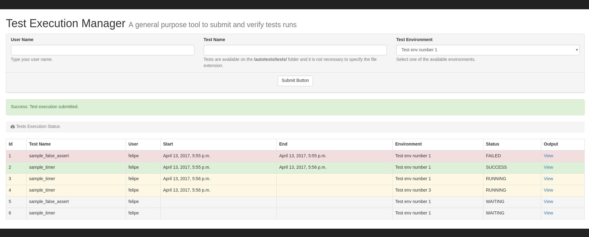

# Test Executiopn Manager

The Test Execution Manager is a general purpose tool to submit and check tests execution.



The project has two main componentes:
* Scheduler
* Django App

The scheduler is the component responsible for starting the execution of the tests according to the environment selected as well as checking if the tests have already finished so its status can be properly updated.
The Django App is a regular RESTful API to serve html to clients.

This project is based in a free bootstrap template [SB Admin](https://startbootstrap.com/template-overviews/sb-admin/).

### Intallation

```
pip install requirements.txt
```

### Running

* First, start the scheduler:
```
./start_scheduler.sh
```

* Second, start the web server:
```
./manage.py runserver
```

### License
Copyright 2017 Felipe Santiago

Permission is hereby granted, free of charge, to any person obtaining a copy of this software and associated documentation files (the "Software"), to deal in the Software without restriction, including without limitation the rights to use, copy, modify, merge, publish, distribute, sublicense, and/or sell copies of the Software, and to permit persons to whom the Software is furnished to do so, subject to the following conditions:

The above copyright notice and this permission notice shall be included in all copies or substantial portions of the Software.

THE SOFTWARE IS PROVIDED "AS IS", WITHOUT WARRANTY OF ANY KIND, EXPRESS OR IMPLIED, INCLUDING BUT NOT LIMITED TO THE WARRANTIES OF MERCHANTABILITY, FITNESS FOR A PARTICULAR PURPOSE AND NONINFRINGEMENT. IN NO EVENT SHALL THE AUTHORS OR COPYRIGHT HOLDERS BE LIABLE FOR ANY CLAIM, DAMAGES OR OTHER LIABILITY, WHETHER IN AN ACTION OF CONTRACT, TORT OR OTHERWISE, ARISING FROM, OUT OF OR IN CONNECTION WITH THE SOFTWARE OR THE USE OR OTHER DEALINGS IN THE SOFTWARE.